<div align="center">



<a href="https://valleytechsolutions.tech"></a>
<a href="https://youtube.com/@valleytechsolutions"></a>
<a href="https://tiktok.com/@valleytechsolutions"></a>
<a href="https://instagram.com/valleytechsolutions"></a>
<a href="https://patreon.com/valleytechsolutions"></a>
<a href="https://discord.gg/blackwiremilitia"></a>

</div>

```ini
[whoami]
handle      = "Your Pal Kal"
role        = "Professional Pal"
base        = "Northern Virginia"
runs        = ["Valleytech Custom Solutions", "Carbon Computers"]
crew        = "Black Wire Militia"
specialty   = ["ESP32 everything", "RF research", "offensive security hardware", "IoT pentesting"]
currently   = "designing boards, flashing firmware, filming the whole thing"
contact     = "collab@yourpalkal.com"
```

## `> ls ./arsenal`

| | Project | What it does |
|:-:|---|---|
| 📡 | **[CardConverter](https://github.com/valleytechsolutions/CardConverter)** | RF hotswap board for the M5Stack Cardputer ADV |
| 🧩 | **[PALPack](https://github.com/valleytechsolutions/PALPack)** | GPIO / RF expansion board for the Cardputer ADV — XIAO ESP32-C5 + GPS |
| 🐦‍⬛ | **[Flock-Noir](https://github.com/valleytechsolutions/Flock-Noir)** | IR Flock camera detector + wardriver with GPS logging |
| 🚨 | **[Skid-Detector](https://github.com/valleytechsolutions/Skid-Detector)** | Blue-team nightlight — ESP32 mood light that snitches on network skids |
| 📖 | **[BWM Technical Reference Guide](https://github.com/valleytechsolutions/BWM-Technical-Reference-Guide)** | Hardware reference tool for microcontrollers |
| 📌 | **[black-wire-pinouts](https://github.com/valleytechsolutions/black-wire-pinouts)** | Pinout database for ESP32, Arduino and Raspberry Pi |

## `> cat ./toolchain`

<p>


</p>

## `> tail -f ./youtube.log`

<!-- YOUTUBE:START -->- 📼 [Raspberry Pi Pico 2 W HDMI Project #raspberrypi](https://www.youtube.com/shorts/5vk1fADX3x4) <sub>`2026-10-02`</sub>
- 📼 [The Monster RF For M5stack Tab5, Core Series, &amp; Cardputer](https://www.youtube.com/watch?v=XKH0O_J4C2w) <sub>`2026-10-02`</sub>
- 📼 [Biscuit Crumb Video Soon! #biscuitshop #esp32](https://www.youtube.com/shorts/SNtY24pYzCA) <sub>`2026-10-02`</sub>
- 📼 [Paclock 90A-Pro](https://www.youtube.com/shorts/9IodLBk48kY) <sub>`2026-10-02`</sub>
- 📼 [m5stack Core Faces #m5stack #esp32](https://www.youtube.com/shorts/Ou0c0j_aCaw) <sub>`2026-10-01`</sub>
<!-- YOUTUBE:END -->

➜ [**More on the channel**](https://youtube.com/@valleytechsolutions)

## `> ./telemetry --live`

<div align="center">


<picture>
  <source media="(prefers-color-scheme: dark)" srcset="https://raw.githubusercontent.com/valleytechsolutions/valleytechsolutions/output/snake-dark.svg"/>
  
</picture>

</div>

<div align="center">

```
 ┌──────────────────────────────────────────────────────────────┐
 │  only hack what you own or have permission to. stay legal.   │
 └──────────────────────────────────────────────────────────────┘
```


</div>
