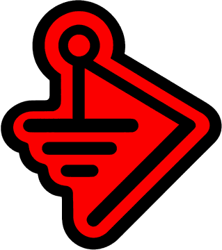

<div align="center">


<a href="https://valleytechsolutions.tech"></a>
<a href="https://youtube.com/@valleytechsolutions"></a>
<a href="https://tiktok.com/@valleytechsolutions"></a>
<a href="https://instagram.com/valleytechsolutions"></a>
<a href="https://patreon.com/valleytechsolutions"></a>
<a href="https://discord.gg/blackwiremilitia"></a>

</div>

<p align="center">
<a href="#bwm-guide"></a>
<a href="#arsenal"></a>
<a href="#toolchain"></a>
<a href="#youtube"></a>
<a href="#telemetry"></a>
</p>

<a name="bwm-guide"></a>

## `> ./black-wire-guide --launch`

<div align="center">

<a href="https://valleytech-black-wire-guide.pages.dev/" title="Open the Black Wire Maker's Technical Reference Guide"></a>

### The Black Wire Maker's Technical Reference Guide

Board pinouts, manufacturer source files and power data for **ESP32, Arduino, Raspberry Pi, RP2040/RP2350**, displays, sensors and maker modules.<br/>
Every reference keeps its source, revision and review status, and the whole library works offline.

<a href="https://valleytech-black-wire-guide.pages.dev/"></a>
<a href="https://valleytech-black-wire-guide.pages.dev/wiki/"></a>
<a href="https://github.com/valleytechsolutions/BWM-Technical-Reference-Guide/releases/latest"></a>
<a href="https://github.com/valleytechsolutions/black-wire-pinouts"></a>

<sub>Makers · Educators · Students · Hobbyists · Engineers — <a href="https://github.com/valleytechsolutions/BWM-Technical-Reference-Guide">source on GitHub</a></sub>

</div>

```ini
[whoami]
handle      = "Your Pal Kal"
role        = "Professional Pal"
base        = "Northern Virginia"
runs        = "Valleytech Custom Solutions"
crew        = "Black Wire Militia"
specialty   = ["ESP32 everything", "RF research", "offensive security hardware", "IoT pentesting"]
currently   = "designing boards, flashing firmware, filming the whole thing"
contact     = "collab@yourpalkal.com"
```

<a name="arsenal"></a>

## `> ls ./arsenal`

| | Project | What it does |
|:-:|---|---|
| 📡 | **[CardConverter](https://github.com/valleytechsolutions/CardConverter)** | RF hotswap board for the M5Stack Cardputer ADV |
| 🧩 | **[PALPack](https://github.com/valleytechsolutions/PALPack)** | GPIO / RF expansion board for the Cardputer ADV — XIAO ESP32-C5 + GPS |
| 🐦‍⬛ | **[Flock-Noir](https://github.com/valleytechsolutions/Flock-Noir)** | IR Flock camera detector + wardriver with GPS logging |
| 🚨 | **[Skid-Detector](https://github.com/valleytechsolutions/Skid-Detector)** | Blue-team nightlight — ESP32 mood light that snitches on network skids |
| 📌 | **[black-wire-pinouts](https://github.com/valleytechsolutions/black-wire-pinouts)** | Pinout database for ESP32, Arduino and Raspberry Pi |

<a name="toolchain"></a>

## `> cat ./toolchain`

<p>


</p>

<a name="youtube"></a>

## `> tail -f ./youtube.log`

<!-- YOUTUBE:START -->- 📼 [Wide Angle IR Reciever](https://www.youtube.com/shorts/LQ-KmtV_AZ4) <sub>`2026-10-09`</sub>
- 📼 [biscuit](https://www.youtube.com/shorts/N3uOBVaIuaY) <sub>`2026-10-09`</sub>
- 📼 [MakerPhone Kickstarter Ends Soon](https://www.youtube.com/shorts/r3thrnwPfuM) <sub>`2026-10-09`</sub>
- 📼 [Xiao 1.47in IPS Display ESP32-S3 Plus](https://www.youtube.com/watch?v=2iXLf_5kyTY) <sub>`2026-10-09`</sub>
- 📼 [POOM Updates](https://www.youtube.com/shorts/q8kv3BURfUM) <sub>`2026-10-09`</sub>
<!-- YOUTUBE:END -->

➜ [**More on the channel**](https://youtube.com/@valleytechsolutions)

<a name="telemetry"></a>

## `> ./telemetry --live`

<div align="center">


<picture>
  <source media="(prefers-color-scheme: dark)" srcset="https://raw.githubusercontent.com/valleytechsolutions/valleytechsolutions/output/snake-dark.svg"/>
  
</picture>

</div>

<div align="center">

### I Love Your face


</div>
